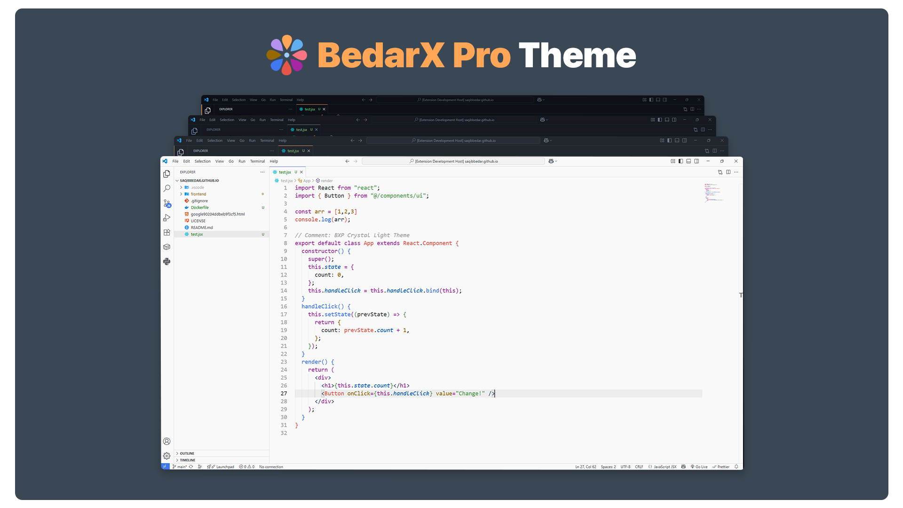

# BedarX Pro - Changelog

## [2.0.0] - 2026-02-20

### Complete Theme Redesign

This is a **major release** with a completely redesigned theme collection. All themes have been rebuilt from the ground up with unique identities, proper depth hierarchy, and signature accent colors.

### New Theme Collection

- **BedarX Obsidian** (Dark) - Warm obsidian backgrounds with rose-coral accent `#E06B74`
- **BedarX Sapphire** (Dark) - Cool navy backgrounds with sapphire blue accent `#4A90D9`
- **BedarX Onyx** (Dark) - True black AMOLED-friendly with amber gold accent `#E5A054`
- **BedarX Pearl** (Light) - Warm cream backgrounds with rose-coral accent `#D95560`

### Key Improvements

- **Proper Background Hierarchy** - Each theme now has 4 distinct depth levels for visual clarity
- **Unique Signature Accents** - Every theme has its own identity color
- **Gemstone Naming Convention** - Consistent, memorable theme names
- **Eye-Friendly Syntax Highlighting** - Carefully balanced colors for long coding sessions
- **Vibrant Terminal Colors** - Enhanced ANSI colors across all themes
- **Complete UI Coverage** - 200+ UI color tokens defined per theme

### Breaking Changes

- **Removed:** BXP Midnight Aurora (replaced by BedarX Sapphire)
- **Removed:** BXP Stellar Nova (replaced by BedarX Onyx)
- **Removed:** BXP Crystal Light (replaced by BedarX Pearl)
- **Removed:** BXP Dark Default (replaced by BedarX Obsidian)

### Technical

- Lowered VS Code engine requirement to `^1.60.0` for broader compatibility
- Modernized build system with ES modules
- Restructured color definitions with comprehensive documentation

---

## [1.0.0]

### Major Changes
- **Removed:** BedarX Pro Classic and BedarX Pro Modern themes
- **Renamed & Enhanced:** BedarX Pro Midnight is now **BXP Midnight Aurora** with improved palette and contrast
- **Enhanced:** BedarX Pro Light theme updated for better clarity and consistency (now **BXP Crystal Light**)
- **Added:** Two new themes:
  - **BXP Dark Default:** A modern, high-contrast dark theme
  - **BXP Stellar Nova:** A professional dark theme with stellar-inspired accents
- **Changed:** Updated extension logo for a fresh, modern look

## [0.0.4]

### Changed
- Enhanced UI elements visibility and contrast
- Updated button foregrounds to be more appealing
- Improved badge and extension badge colors
- Refined sidebar title and section header foregrounds
- Optimized status bar visibility
- Enhanced link colors for better visibility
- Updated checkbox styling
- Improved scrollbar and minimap slider visibility

### Fixed
- Button contrast issues
- Dim scrollbar sliders
- Sidebar visibility problems
- Status bar readability
- Badge contrast issues

## [0.0.3]

### Added
- GitHub Actions workflow for automated releases
- Release information tracking system

### Changed
- Improved syntax highlighting colors
- Updated dependencies foreground colors
- Enhanced other variables coloring
- Refined theme color consistency

### Fixed
- Dependencies token colors
- Other variables highlighting
- Color scheme optimizations

## [0.0.2]

### Changed
- Updated README.md with improved documentation
- Added .vscodeignore to optimize package size
- Optimize extension overall size

## [0.0.1]

### Added

- Initial release of BedarX Pro theme collection
- Four distinctive theme variants:
  - BedarX Pro Classic: Professional blue-grey dark theme
  - BedarX Pro Midnight: Deep blue-based dark theme
  - BedarX Pro Modern: Clean neutral dark theme
  - BedarX Pro Light: Crisp light theme
- Comprehensive language support for popular programming languages
- Custom workbench colors for improved UI experience
- Optimized syntax highlighting for readability

### Features

- Enhanced terminal colors and styling
- Improved bracket pair colorization
- Distinct colors for different syntax elements
- High contrast ratios for better accessibility
- Git decoration colors for clear version control status
- Professional workbench design across all variants
- Refined sidebar and activity bar aesthetics

### Supported Languages

- JavaScript/TypeScript
- Python
- Java
- C/C++/C#/Objective C
- HTML/XML/CSS
- PHP
- Markdown
- JSON/YAML
- Rust
- Ruby
- R
- Go
- Lua
- Perl
- Powershell/Bash
- And more...

### Known Issues

- README preview colors in VS Code not fully themed
- Selection background color inconsistencies in certain UI elements
- Some UI elements' selection states not responding to theme colors

### Development

- Set up basic project structure
- Added contribution guidelines
- Created comprehensive documentation
- Established version control workflow

[2.0.0]: https://github.com/saqibbedar/BedarX-Pro/releases/tag/v2.0.0
[1.0.0]: https://github.com/saqibbedar/BedarX-Pro/releases/tag/v1.0.0
[0.0.4]: https://github.com/saqibbedar/BedarX-Pro/releases/tag/v0.0.4
[0.0.3]: https://github.com/saqibbedar/BedarX-Pro/releases/tag/v0.0.3
[0.0.2]: https://github.com/saqibbedar/BedarX-Pro/releases/tag/v0.0.2
[0.0.1]: https://github.com/saqibbedar/BedarX-Pro/releases/tag/v0.0.1
