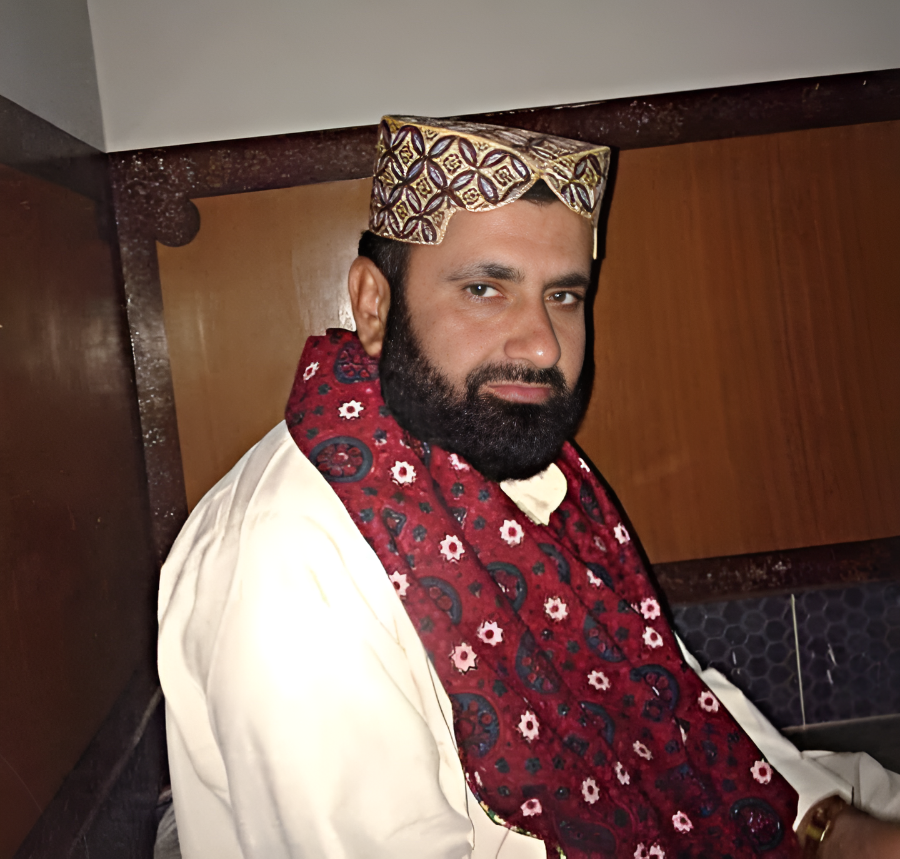

# About BedarX Pro

  
  <h2>In Memory of Bedar Bakhshal</h2>

This theme is created in memory of my beloved father, Bedar Bakhshal, who departed from this world on February 27, 2022. I've made this theme freely available to all developers, hoping it brings clarity and comfort to your coding journey, just as my father brought light to our lives.

If you find this theme helpful, please remember my father in your prayers. Each line of code written with this theme carries forward his memory and spreads goodness to others.

  <em>"Indeed, we belong to Allah, and indeed, to Him we will return."</em>
   
  <small>(إِنَّا لِلَّهِ وَإِنَّا إِلَيْهِ رَاجِعُونَ)</small>

