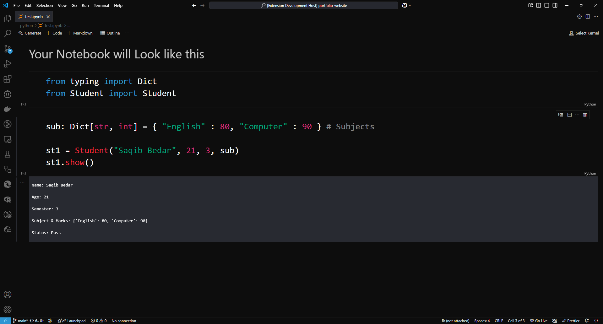
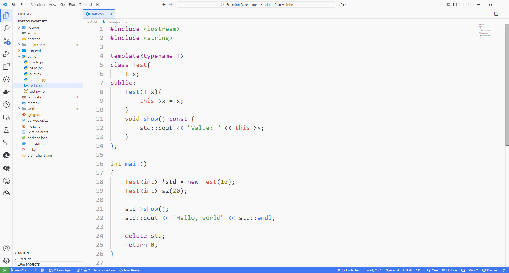

# [BedarX Pro](https://github.com/saqibbedar/BedarX-Pro) | [GitHub Repo](https://github.com/saqibbedar/BedarX-Pro) 

A **ChatGPT-inspired**, iconic **BedarX Pro** theme for VS Code, crafted in memory of my beloved father, [`Bedar Bakhshal`](./Public/aboutExtension.md). Designed for both **light** and **dark mode**.

<!--  
 
 -->

## SCREENSHOTS

### Default - Dark Crimson

### Light

## Donation

If you like this extension, you can **[Buy Me a Coffee](https://buymeacoffee.com/saqibbedar)**. It will encourage me to make this extension better and better!

Thanks List:
- To me still.

## CHANGELOG

[CHANGELOG.MD](./CHANGELOG.md)

## CONTRIBUTION

Navigate to ([https://github.com/saqibbedar/BedarX-Pro/blob/main/CONTRIBUTING.md](https://github.com/saqibbedar/BedarX-Pro/blob/main/CONTRIBUTING.md)) for detailed instructions on how to contribute to this theme.

To get started, first fork and clone this repository

`cd` to the `BedarX-Pro` folder

Press `F5` to see live preview, and start editing

#### Thankyou for using this extension, [Leave a Star on Github ⭐](https://github.com/saqibbedar/BedarX-Pro)

<!-- ### Contributors

This project exists thanks to all the people who contribute.
 -->

<!-- ### Sponsors

Support this project by becoming a sponsor.  -->
